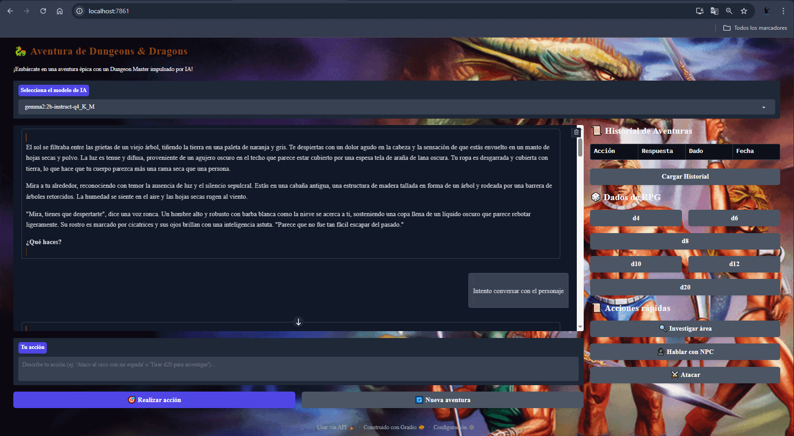

# 🐉 D&D Adventure AI
A solo Dungeons & Dragons adventure powered by Ollama (local LLM), with SQLite for session history, dice rolls with Pygame sounds, and a Gradio UI styled like a medieval parchment.

## Features
- AI-driven Dungeon Master with vivid storytelling
- SQLite database to persist game sessions
- Dice rolls with sound effects
- Retro D&D-themed UI
- Gradio UI for easy interaction

## Prerequisites
- Python 3.8+
- Ollama
- SQLite
- Pygame
- Gradio

## License
This project is licensed under the MIT License - see the [LICENSE](LICENSE) file for details.

## Contributing
Contributions are welcome! Please read our [contributing guidelines](CONTRIBUTING.md) for more information. (comming soon)

## Reporting Issues
If you encounter any issues or bugs, please report them on the [issue tracker](reporting Issues)
If you encounter any issues or bugs, please report them on the [issue tracker](https://github.com/Charran78/ROL/issues).

## Setup
1. Install Ollama: `curl https://ollama.ai/install.sh | sh`
2. Pull a model: `ollama pull gemma2:2b-instruct-q4_K_M`
3. Clone this repository: `git clone . Clone this repository: git clone : git clone https://github.com//Charran78/ROL.git`
4. Navigate to the project directory: `cd yourrepository`
5. Create a virtual environment: `python -m venv venv`
6. Activate the virtual environment: `source venv/bin/activate` (Linux/macOS) or `venv\Scripts\activate` (Windows)
7. Install dependencies: `pip install -r requirements.txt`
8. Run: `python DMIA.py`
9. Open your browser and go to: `. Open your browser and go to: `http://localhost:7861/`
10. Start a new game! or continue an existing game!

## Demo

## Thanks to:
- Ollama
- Pygame
- Gradio
- @DeepSeek
- @python community
- @github community
- @Google AI: Gemma2:2b-instruct-q4_K_M

